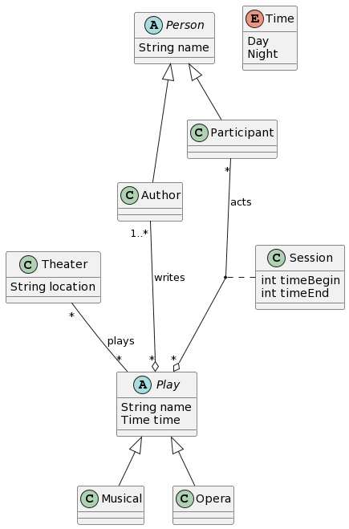

# Dataset

## 1) Car

### 1a)
A car make has a name, and it can have several models (each model has a name). For each model, there can be any number of cars, where each car has a plate number. Every car can have any number of seats, where each seat has a size. Also, all cars have 4 wheels, and each wheel has a diameter. Finally, all cars have one engine, where each engine has a specific power.

### 1b)
Represent cars. Cars belong to models, which in turn belong to makes. Each car has four wheels, one engine and a set of seats. Every make and model have a unique name. Each wheel has a diameter, which must be the same for all wheels of the same car. Each engine has a certain 
power. Likewise, the seats have a size, which must be the same for all the seats of the cars of the same model. 
Each car has a number plate that identifies it.

## 2) Video store

### 2a)
Video store has multiple clients and these clients can rent many movies. Video store, clients and movies have a name.

### 2b)
We are modeling a video store. There are also clients and movies in the system, all of which have a name. Video stores rent out movies, where the same movie can be offered in any video store. Video stores have clients.

### 2c)
Please build a diagram that represents video stores. Video stores rent movies and have clients. All entities (video stores, clients and movies) have names. Please include in the diagram the multiplicities of all associations.

## 3) School

### 3a)
One or more professors can teach any number of courses. Five or more students can be part of any number of courses. One to four students can be part of a Dormitory unit. Each professor and student has a name. Courses have a name and number of credits. Each dormitory unit has a price.

### 3b)
We know that courses have a name and a specific number of credits. Each course can have one or more professors, who have a name. Professors could participate in any number of courses. For a course to exist, it must aggregate, at least, five students, where each student has a name. Students can be enrolled in any number of courses. Finally, students can be accommodated in dormitories, where each dormitory can have from one to four students. Besides, each dormitory has a price.

### 3c)
Please build a diagram that represents Professors and Students. They both have a name. There are also courses, which are taught by one or more professors, and are taken by five or more students. Each course has a name and a number of credits. Finally, Dormitory units can host between 1 and 4 students. Each Dormitory unit has a price.

## 4) Airline

### 4a)
Any number of airlines operates in any number of airports. The relation between airport and airline contains a details class with the operating cost. Each airline has a name and each airport has a code and city.

### 4b)
Many different airlines can operate in different airports. An airline has a name, and an airport has a code and is in a city. Each airline has associated a cost for operating in a specific airport. Besides, the operation of an airline in a specific airport can be started and stopped at any time, and its operating cost can be updated at any time.

### 4c)
Please build a diagram that represents Airlines that operate in Airports. The details of every airline operation include the operating costs, as well as methods to start and stop the operation, and to update the operating cost. Airports have a code and are placed in a city.

## 5) File system

### 5a)
We have file system elements, which can be a folder and a file. All file system elements have a name. Every file system element 
must belong to a folder, and folders can aggregate any number of file system elements. Files have 
information about their extension and their size.

### 5b)
Please build diagram that represents file system elements, which can be files or folders. All file system elements have a name. Moreover, files have an extension and a size. Folders may contain other file system elements.

## 6) Theatre

### 6a)
Make model of a Theater. Theaters have a location, and they can play any play, which can be musicals or operas. Plays have a name and can be played either at day or night. Plays are written by one or more authors, who have a name. There are many participants who act in a play,  participants also have a name. A particular participant acts in a particular session of a play, where each session begins and ends at a specific time. Both authors and participants are persons.

### 6b)
Please build a diagram that represents theaters that play musicals and operas. Each play (musical and opera) has a name and the time of the performance, which can be either "Day" or "Night". Each theater has a location. Each play is written by one or more authors, who are persons. Each play has a set of participants, who are also persons. Finally "sessions" model the relationship between the play and its participants. Each session has a starting and finishing time. Please include in the diagram the multiplicities of all associations.

