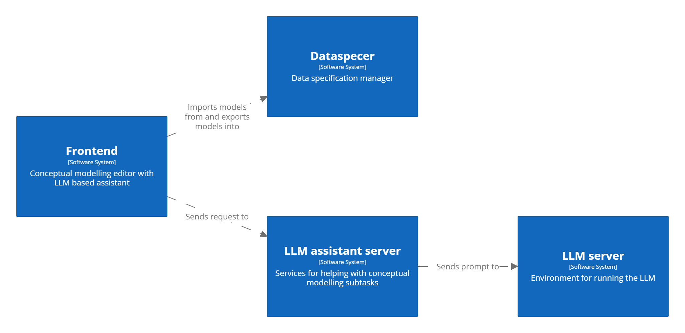

# Architecture

## Complete overview

 

## Dataspecer integration

 

- the frontend is integrated with the [Dataspecer tool](https://github.com/mff-uk/dataspecer)
    - a conceptual model can be imported from this tool or exported into this tool by specifying the corresponding model ID
        - [here is a tutorial on how to import and export conceptual model from and into Dataspecer](frontend-import-export.md)

 

## The LLM assistant server workflow

 

- when the user is creating his conceptual model on the frontend he can call our [LLM assistant server](backend-dev.md#llm-assistant-server) throught the UI for some help
- when the LLM assistant server is called a corresponding method is called on the instance of the `LLMAssistant` class from the `utils/llm_assistant.py` script

- now the following needs to be done:
    1) get corresponding prompt template
    2) fill in all prompt symbols in the prompt template
    3) send this prompt to the LLM
    4) parse the output from the LLM
    5) show the output to the user

 

### Prompt processing
- `LLMAssistant` uses instance of the `PromptManager` class from `utils/prompt_manager.py` to find the corresponding prompt template
    - [here is the directory with all our prompt templates](../prompts/)
- then the class `Replacer` from `utils/replacer.py` replaces the prompt symbols defined inside `definitions/prompt_symbols.py` with the corresponding parameters sent from the frontend
- when the domain description is being filled in it can be firstly filtered by either our semantic or syntactic algorithm
    - first the domain description is splited into chunks by the class `TextSplitter` from `utils/text_splitter.py`

    - the semantic algorithm uses instance of the class `SemanticTextFilterer` from `text-filterer/semantic_text_filterer.py`
        - it uses a language model from [SentenceTransformers](https://sbert.net/) library
    - the syntactic algorithm uses instance of the class `SyntacticTextFilterer` from `text-filterer/syntactic_text_filterer.py`
        - it uses a language model from [MorphoDiTa](https://pypi.org/project/ufal.morphodita/) library

- when all symbols in the prompt are filled in the prompt is ready to be sent to the [LLM server](backend-dev.md#llm-server)

 

### LLM output processing
- the `LLMAssistant` uses the instance of the class `LLMManager` from `utils/llm_manager.py` to send the prompt to the LLM server and to parse the output
- if the outputed object contains original text then an instance of the class `OriginalTextFinder` from `utils/original_text_finder.py` is used to find it's original text indexes to highlight to the user this object in the domain description
    - the class `OriginalTextFinder` is able to recover from some minor mistakes which is tested inside the script `tests/find_original_text_indexes.py`
- also for consistency we are automatically converting any generated name from any convention into the standard convention inside the script `utils/convention_convertor.py`
    - correctness of this conversion is tested inside the `tests/convention_convertor.py` script

- as soon as some object is generated by the LLM and checked by our scripts it is sent back to the user on the frontend for a faster response time

- if the user wants to highlight the parts of his domain description that he already covered with his conceptual model then the instance of the class `OriginalTextMerger` is used to merge all original text indexes
    - correctness of the merging is tested in `tests/merge_original_text_indexes.py`