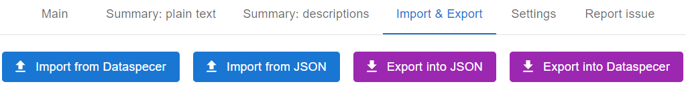
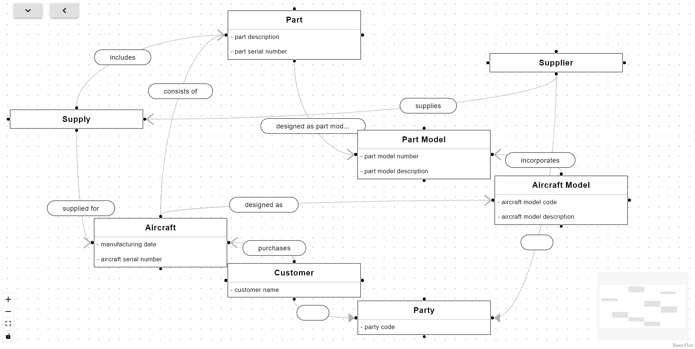
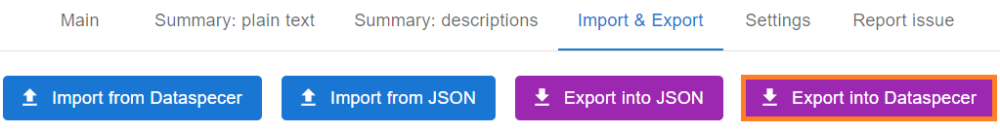
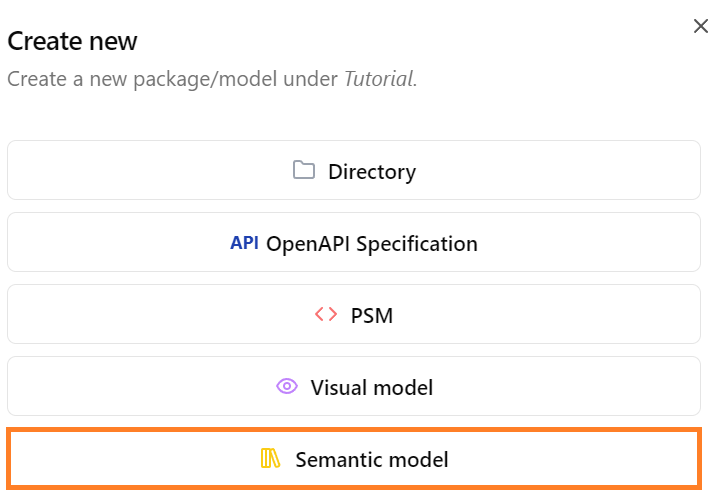
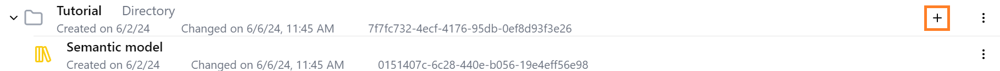
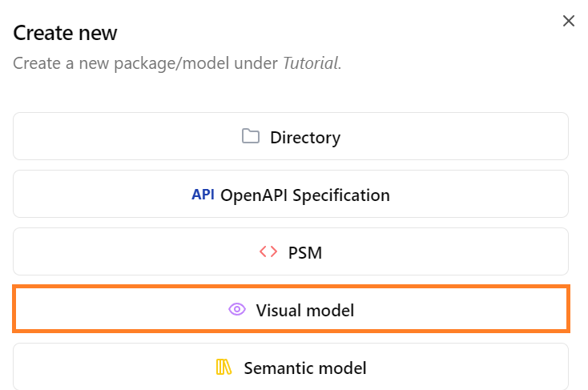

# Frontend import and export tutorial

- the conceptual model can be imported or exported in [this JSON format](https://schemas.dataspecer.com/adapters/simplified-semantic-model.v1.0.schema.json)

- on the topbar click on the "Import & Export" tab:

    

- "Import from JSON" button lets you load a conceptual model from file in the mentioned JSON format from your device

- "Export from JSON" button saves the conceptual model in the mentioned JSON format in your device

 

## Import conceptual model from Dataspecer
- open [Dataspecer package manager](https://tool.dataspecer.com/manager/)
- find the conceptual model you want to import
- copy the model ID as shown in the picture:

    

 

- in our frontend click on the "Import from Dataspecer" button:

    

 

- paste the corresponding model ID and click on the green "Import" button:

    

 

- now the corresponding conceptual model is successfully loaded into our frontend:

    

 

## Export conceptual model into Dataspecer

- to export your conceptual model into Dataspecer click on the "Export into Dataspecer" button:

    

 

- in the dialog paste the ID of the model you want to rewrite and click on the green "Export" button

    

 

#### Get a new model ID

- to get a new model ID from the Dataspecer click on the "New package" button in the [package manager](https://tool.dataspecer.com/manager/):

    

 

- create a new directory and click on the "Save changes" button:

    

 

- find your directory in the manager and click on the "plus" button:

    

 

- click on the "Semantic model" buton

    

 

- the new model ID was created so copy this new model ID

    

 

- now in our frontend click on the "Export into Dataspecer" button

    

 

- paste the new model ID and click on the green "Export" button and we are done

    

 

## Open the same conceptual model but in a different Dataspecer tool

- our conceptual model with `ID=0151407c-6c28-440e-b056-19e4eff56e98` looks like this:

    

 

- now our goal is to open the same conceptual model but in a different Dataspecer tool

- for example in our directory in the [Dataspecer package manager](https://tool.dataspecer.com/manager/) we can add "visual model" like this:

    

    

 

- click on the "Open" button:

    

 

- this opens the conceptual model in the Dataspecer Conceptual Model Editor (CME) tool

- make the classes of the conceptual model visible by clicking on the "sunglasses" buttons

    

 

- now we successfully opened the same conceptual model as in our frontend but in a different Dataspecer tool

    