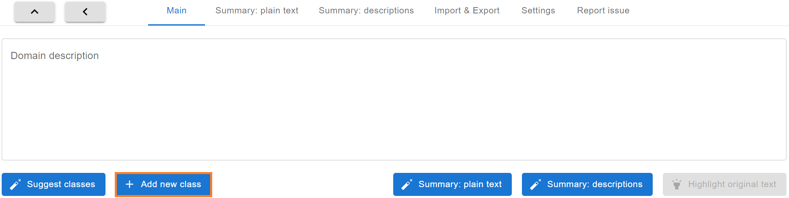
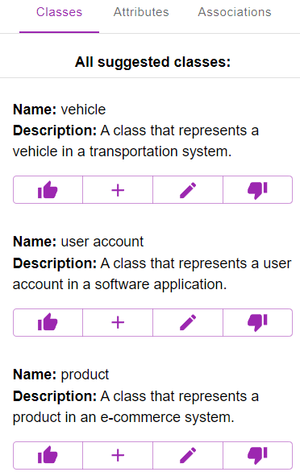
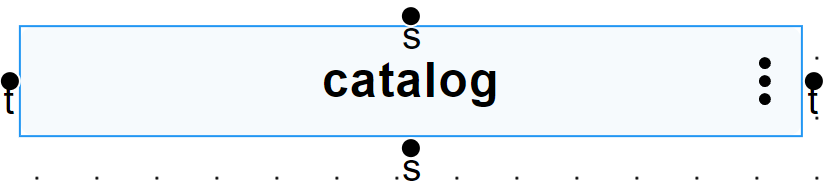
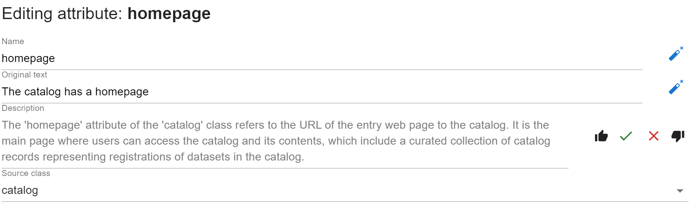
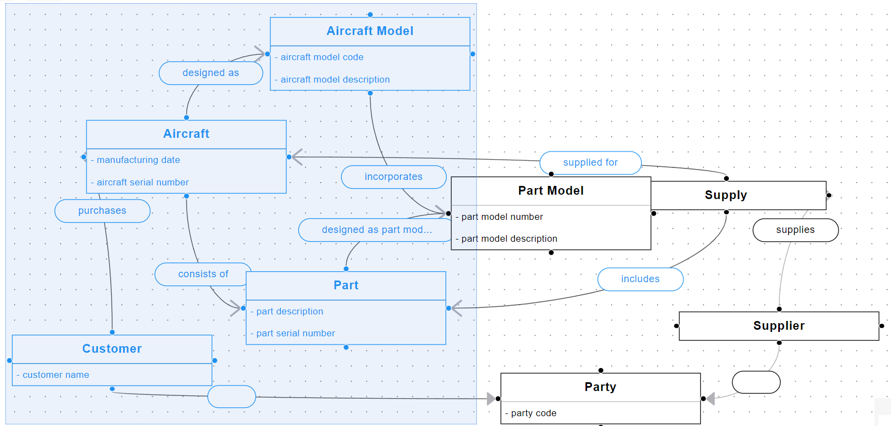
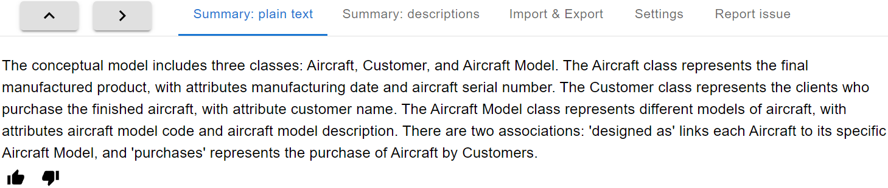
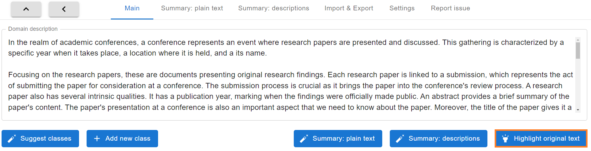

# Frontend user documentation

[Here is a tutorial on how to import and export a conceptual model into and from the Dataspecer.](frontend-import-export.md)

Our frontend is a conceptual model editor extended by features of our LLM assistant. The assistant helps a human modelling expert in creating domain models.

First, we present the main features of our LLM assistant and then we provide demo links with the demonstration of how the assistant can be used.

 

## Features of our LLM assistent

### 1) suggestions of classes, attributes and associations
- if a domain description is provided then the assistant's suggestions are solely based on the given domain description
    - we support only English
- the domain description can be inserted in the text box on the topbar:

    

 

- for trying out the application, one of the following domain descriptions can be chosen:

    - [data catalog](https://github.com/dataspecer/domain-modeling-benchmark/blob/main/front-end%20evaluation%20domains/data%20catalog/domain-description-01.txt)
    - [gaming](https://github.com/dataspecer/domain-modeling-benchmark/blob/main/front-end%20evaluation%20domains/gaming/domain-description-01.txt)

 

- when the domain description is not provided, the assistant suggests anything it considers reasonable
    - in this case it is better to start modelling by adding a class manually with the "Add new class" button:

        

 

- for suggesting classes by the assistant, the "Suggest classes" button can be used:

    

 

- to have attributes and associations suggested by the assistant, first create a class
- then, hover the mouse over this class, click on the three dots on the right side, and select either the "Suggest attributes" or "Suggest associations" button accordingly

    

 

- the generated suggestions are shown on the sidebar on the right side of the application
- here is an example of 5 generated suggestions by using the "Suggest classes" button without a domain description:

    

     

    - the "plus" button can be used to add the corresponding suggestion to the conceptual model
    - the "edit" button can be used to first edit the corresponding suggestion and then add it to the conceptual model
    - the "like" or "dislike" button can be used to rate the corresponding suggestion

 

- when editing an attribute it can be changed into an association and vice versa:

    

 

- if the domain description is provided then for each suggestion is also available "highlight" button that for attributes and associations shows in which part of the domain description the assistant found the corresponding suggestion

- for example, the highlighted original text for the attribute "homepage" of the class "catalog" looks like this:
    
    

 

- for suggesting associations in between two classes an edge can be dragged between two nodes:

    

 

- and then proceed by clicking on the "Suggest associations" button

    

 

- note that an edge can be dragged only between the handles (the "black dots") of the nodes

- when the mouse is hovered over any node, the handles display either "s" or "t":

    

    - "s" stands for the source class and "t" stands for the target class of the association
    - an edge can be dragged either from "s" to "t" or from "t" to "s"

 

- when editing any element the "magic wand" button can be used on the right side to let the assistant suggest the corresponding field:

    

 

- for example, the suggested description for the attribute "homepage" of the class "catalog" looks like this:

    

    - the suggestion can be accepted or rejected with the buttons on the right side

 

### 2) summary of the conceptual model

- the assistant can summarize any selected part of the conceptual model
- the selected domain elements are visually represented by the blue color
- the easiest way to select some part of the conceptual model is by creating a selection area with the mouse by holding shift and left mouse button

    

 

- then the assistant can summarize the selected part:
    - either in an unstructured plain text by clicking on the topbar on the button "Summary: plain text"
    - or in structured descriptions by clicking on the topbar on the button "Summary: descriptions"

    

 

- for example, when this part of the conceptual model is selected (the light blue color denotes the selected classes, attributes and associations):

    

 

- this is what the button "Summary: plain text" generates:

    

 

- and this is what the button "Summary: descriptions" generates:

    

 

- note: the assistant ignores the domain description when generating the summary

 

### 3) highlighting in the domain description which parts are represented by the conceptual model

- when creating conceptual model with the help of the assistant each suggested element contains also the already mentioned original text
- when some part of the conceptual model is selected all these original texts can be highlighted in the domain description using the "Highlight original text" button on the topbar:

    

 

- for example, for a domain description about conference papers and this class:

    

 

- this is what the button "Highlight original text" shows:

    

 

- for example, this feature can be used to check whether the conceptual model is completely representing the given domain description
- however, note that the assistant can make mistakes and that some part of the domain description is highlighted does not necessarily mean that it is represented by the conceptual model
    - also the opposite thing applies: some non-highlighted parts of the domain description can already be represented by the conceptual model

- for simplicity, whenever the domain description changes the computed original text indexes are discarded so nothing will be highlighted
    - this means that for using this feature it is necessary to work with only one domain description without editing it in the process

### Settings

This is how the settings tab looks like:

 

As shown by the picture it is possible to:
1) ignore domain description to temporarily work without the domain description
2) change the strategy of how the domain description is filtered:
    - according to our experiments, the syntactic variation works the best however, it can be changed to force the assistant to generate different suggestions for attributes and associations

### Demos

- [video demonstrating the work with the domain description](https://youtu.be/1GPYFALsyrw)

- [video demonstrating the work without the domain description](https://youtu.be/wy60G8cuN-M)

- [video demonstrating combination of working with and without the domain description](https://youtu.be/Lw8fMqqCwPY)